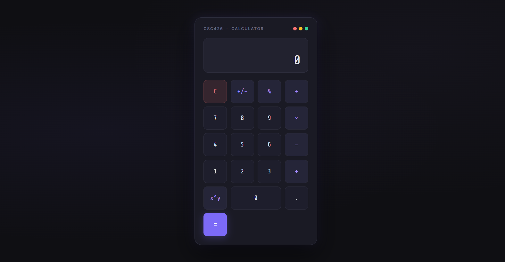
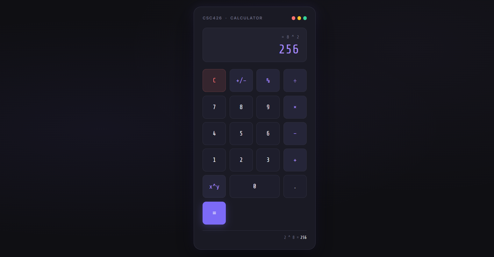
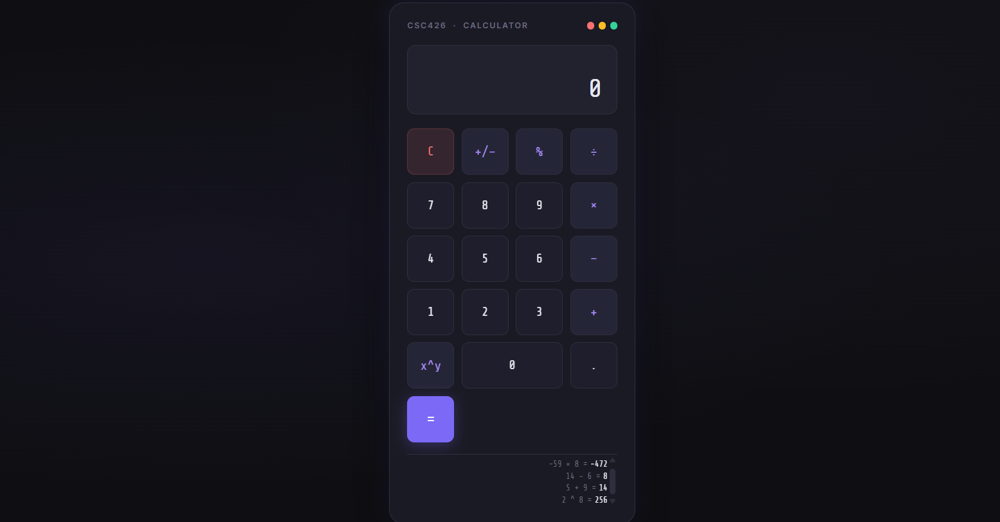

# CSC426: GUI Calculator

A graphical user interface calculator built with HTML, CSS, and JavaScript as part of CSC426 weekly development work.

## Live Demo

Open `index.html` directly in any browser. No server required.

## Screenshots

### Default View

### Power Operation

### Calculation History

## Features

- Basic arithmetic: addition, subtraction, multiplication, division
- Power / exponent (x^y)
- Percentage (%)
- Toggle positive/negative (+/-)
- Clear (C)
- Calculation history — last 8 results, click any to recall
- Full keyboard support
- Division by zero protection

## Technologies Used

| Layer     | Technology          |
| --------- | ------------------- |
| Interface | HTML5, CSS3         |
| Logic     | JavaScript (ES2020) |

## Keyboard Shortcuts

| Key        | Action            |
| ---------- | ----------------- |
| 0-9        | Number input      |
| + - \* /   | Operators         |
| ^          | Power             |
| %          | Percentage        |
| Enter      | Equals            |
| Backspace  | Delete last digit |
| Escape / C | Clear             |
