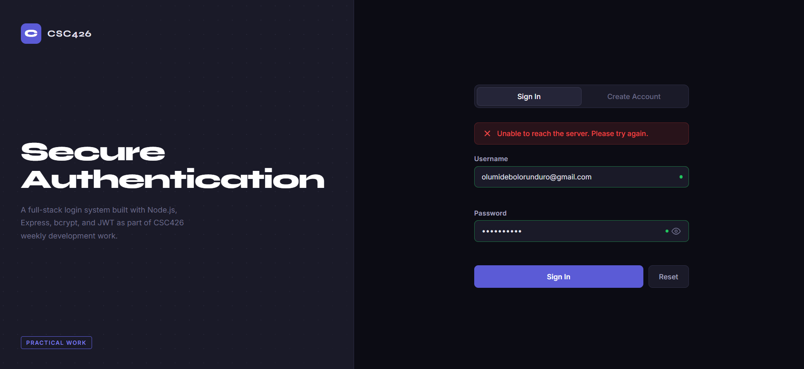
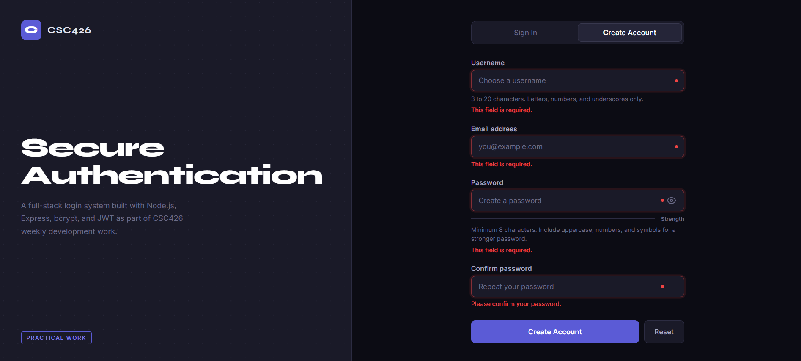
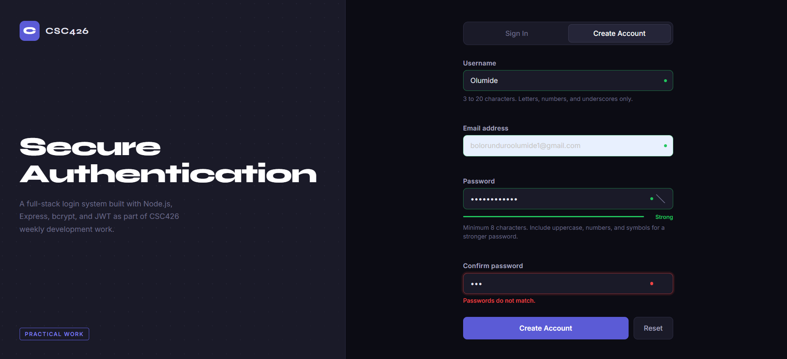
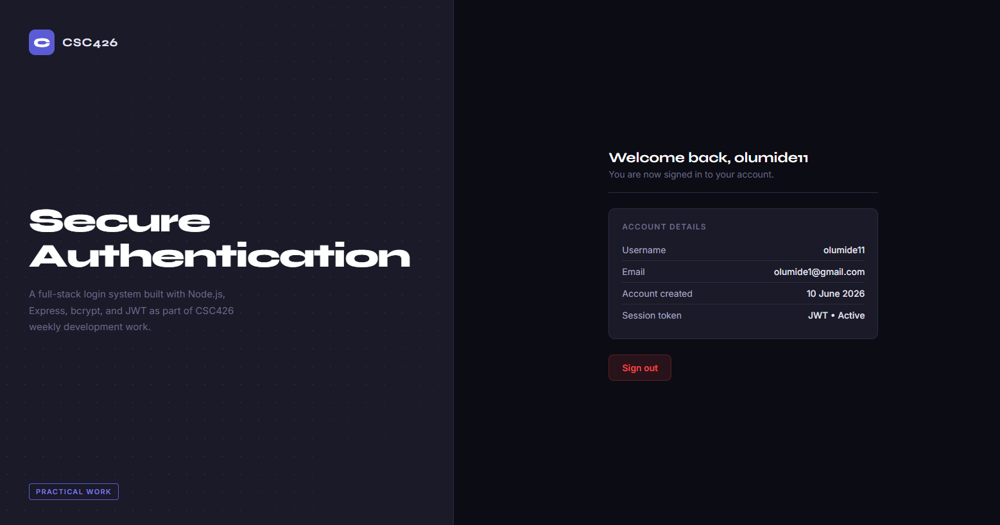

# CSC426: Login Authentication App

A full-stack login and registration system built with HTML, CSS, JavaScript (frontend) and Node.js, Express, bcrypt, and JWT (backend).

## Live Demo

- Frontend: https://csc-426-nu.vercel.app/
- Backend: https://csc426project.onrender.com

## Screenshots

### Login Page

### Register Page

### Validation Errors

### Dashboard

